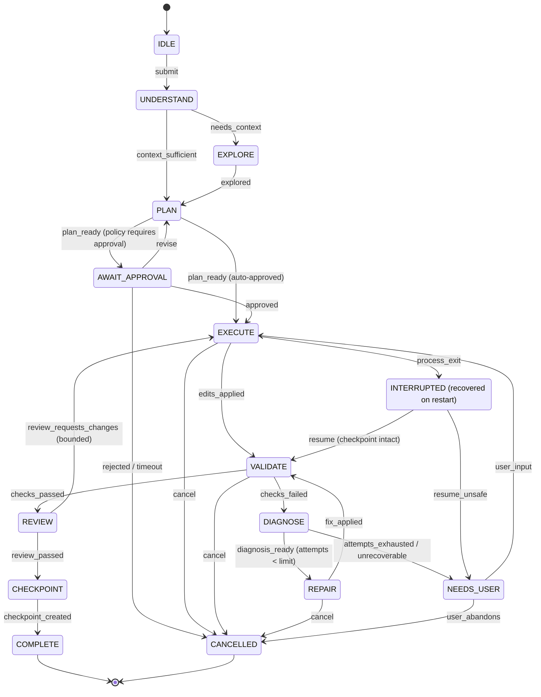

# AutoAPPZ Agent Architecture 2.0

---

## 1. Roles (strategies, not mandatory model calls)

| Role | Responsibility | Activated when |
|---|---|---|
| **Planner** | Understand request; produce a task graph with acceptance criteria; decide decomposition depth | always (may be a single cheap call for trivial tasks) |
| **Explorer** | Map unfamiliar code: retrieve via Context Engine, read, summarize with citations | project unknown to memory or request touches unindexed areas |
| **Architect** | Choose implementation strategy: data model, boundaries, migrations, libraries; update Blueprint | new feature spanning ≥2 layers, schema change, new integration |
| **Builder** | Apply edits via tools (patch/AST/full write), add deps, write migrations/tests | always for writable tasks |
| **Validator** | Run cheapest relevant checks first: syntax → targeted typecheck → lint → affected tests → build → runtime smoke → optional browser test | after every Builder step batch |
| **Debugger** | Diagnose structured diagnostics; propose minimal fix; bounded attempts | validation failure |
| **Reviewer** | Check change set against request + acceptance criteria + project memory; flag unnecessary edits | before checkpoint for non-trivial tasks |
| **Runtime Observer** | Watch preview/build/runtime: startup failure, build errors, console errors, unhandled exceptions, failed network requests, blank screen, health | while runtime is running; feeds diagnostics into tasks |

**Conditional decomposition rule:** a `TaskComplexity` estimate (files touched, layers, schema/auth involvement, blueprint size) selects a profile:
- `trivial` (rename a label): Planner+Builder+Validator in **one model call sequence**, no approval gate unless policy requires.
- `standard` (add a page/form): plan step → approval (optional, project setting) → build → validate → review-lite.
- `complex` (full product, schema+auth): Blueprint → Architect → per-module Builder runs → Validator → Reviewer with criteria.
Roles may share a model and a context; each role run is recorded with its own `agentRunId`, cost and evidence.

---

## 2. Task state machine

Persistence: every transition appends a `task_events` row `{taskId, seq, from, to, event, payloadRef, at}`; effects (tool calls, model calls) are recorded separately with their own ids and linked by `seq`. Recovery reads the journal, verifies the working tree against the last checkpoint (`git status` + recorded hashes), and resumes only into `VALIDATE` (never re-executes edits) or asks the user.

Cancellation: `AbortSignal` threaded through model calls, tool calls, child processes; parked consents are released; state records `cancelledAt` and the partial change set remains inspectable and undoable.

---

## 3. Execution loop (inside EXECUTE/REPAIR)

Native tool calling via the provider adapter (`streamText` with tools). Loop invariants:
- Read-before-write: writes to a file not read (or indexed with matching hash) in this task are rejected with a structured error the model can act on.
- Optimistic concurrency: every edit carries `expectedHash`; mismatch → conflict error, never silent overwrite.
- Step budget per run + token/cost budget per task; hitting a budget transitions to `NEEDS_USER` with a resume option.
- Parallel tool calls allowed for read-only tools; writes are serialized per project.
- Tool results are bounded and structured (`summaryForModel` + artifacts), never raw multi-MB logs.
- The model never sees secrets; env files are read only through a redacting tool.

---

## 4. Prompt assembly

Layers (each a versioned template with snapshot tests): system role & safety → project guidance (untrusted, delimited) → Blueprint excerpt (relevant entities/pages) → Project Memory facts (relevant) → retrieved code context (with "why included") → diagnostics/test failures (structured) → task plan & acceptance criteria → conversation window. Budgeted by the Context Engine.

---

## 5. Validation & repair loop

Ordered checks with cost tiers and impact scoping:
1. **Syntax** (tree-sitter parse of changed files, ms)
2. **Targeted typecheck** (`tsc --incremental` project or `tsgo`; report only diagnostics in changed files + dependents)
3. **Lint** (ESLint/Biome with autofix for formatting)
4. **Affected tests** (from import graph: tests importing changed modules)
5. **Build** (isolated worktree when a dev server is running)
6. **Runtime smoke** (start/refresh dev server, health probe, check console errors within N seconds)
7. **Browser check** (optional Playwright: navigate acceptance-criteria routes, assert no fatal errors)

Diagnostics are normalized to `Diagnostic {source, severity, file, range, code, message, stack?, command?, likelyCause?}`; the Debugger receives the top-N unique diagnostics (deduped by file+code) with 10–30 lines of context each, not whole logs. Attempt limits: default 3 repair rounds per task, each round may only touch files related to the diagnostics (enforced by the tool layer with a soft warning on scope expansion). Never infinite: the fourth failure → `NEEDS_USER` with a diagnosis summary and options (retry with a stronger model, rollback to checkpoint, continue manually).

---

## 6. Blueprint and requirements traceability

`Blueprint` (YAML in platform DB, rendered/editable in UI): `product, users, roles, pages, navigation, entities, database, authentication, integrations, api, design_system, deployment, tests, acceptance_criteria`. The Planner derives `REQ-nnn` with `AC-n` per feature; the Reviewer must produce a criteria matrix (met/unmet/unknown with evidence: test name, file, screenshot) before `CHECKPOINT`; unmet criteria keep the task in `REVIEW → EXECUTE` (bounded) or surface to the user. For "build a complete X" requests the Planner expands scope using domain checklists (customer app, operations/admin, engineering baseline) and asks the user to confirm scope before Architect.

---

## 7. Project memory

Distilled facts with provenance (`taskId`, timestamp, confidence, category), written by the Reviewer/Architect at task end and editable by the user; retrieved by category relevance; never the raw transcript.

---

## 8. Model router

Capability descriptors per model: `reasoning, fast-edit, vision, large-context, tool-calling, local, inexpensive, json-mode` + limits/costs. Routing policy per role and task complexity (e.g., Explorer/Validator summaries → inexpensive fast model; Architect/Debugger → reasoning model) with privacy constraints (local-only projects), latency and cost weights; the user's explicit selection always overrides; every call records the routed model.

---

## 9. Sub-agent policy

Sub-agents are role runs with isolated context windows, not separate products. Rules: at most one writable sub-run at a time per project; child runs inherit permissions but never widen them; child reports are delimited data; the parent inspects the full diff before checkpoint.

---

## 10. Self-critique

- Approval gates can annoy Makers → project policy `auto-approve plans below complexity X`.
- Role proliferation → roles are functions in `packages/agent`, sharing one loop; profiles decide which run.
- Diagnostics normalization is the hard part → dedicated `packages/validation` with parsers and golden tests per tool.
