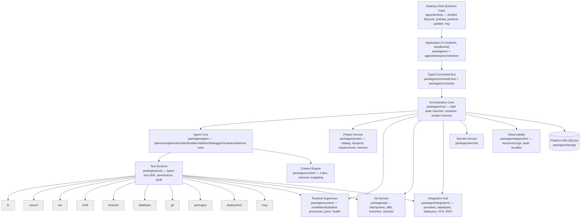

# AutoAPPZ System Architecture

Designed from first principles after the reference reverse-engineering. Every layer below is an explicit package with an ownership boundary; privileged operations never run in the renderer; all cross-boundary calls are typed and schema-validated.

---

## 1. High-level architecture



Processes: **Shell/main** (core, services, tool runtime), **Renderer** (UI only), **Workers** (index worker, validator runners, proxy), **Child processes** (project runtime, package manager, git, MCP servers). The renderer never imports anything from `packages/core` or below; it depends only on `packages/contracts` (types + schemas) and `packages/ui`.

---

## 2. Repository structure (decided)

```
apps/
  desktop/                 Electron host: main entry, preload, renderer app shell, packaging
  docs/                    documentation site (later)
packages/
  contracts/               Zod schemas + TS types for every command, query, event, stream, tool I/O, DTO (the only package shared by renderer and main)
  command-bus/             main-side dispatcher: validation, envelopes, ids, cancellation, streams, subscriptions, per-window capability tokens
  core/                    orchestration: task state machine, session/thread management, project memory, cost accounting, recovery
  agent/                   agent roles (planner, explorer, architect, builder, validator, debugger, reviewer, runtime observer), prompt assembly, model router
  ai-providers/            provider adapters (OpenAI, Anthropic, Google, xAI, OpenAI-compatible, Ollama) + capability descriptors + token/cost estimation
  tools/                   Tool SDK + built-in tools (fs, search, ast, shell, browser, database, git, packages, deployment, mcp) + permission engine + audit hooks
  context/                 Context Engine: indexer (tree-sitter + TS), FTS/BM25, graph, retrieval, budgeting, explanations
  project/                 project catalog, blueprint model, requirements/acceptance criteria, templates registry, project memory store
  runtime/                 Runtime Supervisor: process manager, port leases, health probes, log ring buffers, preview proxy + instrumentation, diagnostics extraction
  git/                     git operations (bundled git via dugite), checkpoint model, diff/patch, conflict detection
  integrations/            Integration Hub interfaces + adapters: database (postgres, supabase, neon), deployment (vercel, netlify, cloudflare, docker), vcs (github), mcp client
  secrets/                 secrets service (OS keychain via safeStorage/keytar abstraction), references, redaction
  storage/                 platform SQLite (Drizzle) schema + migrations + repositories
  diagnostics/             structured logging, correlation ids, telemetry hooks (opt-in), diagnostic bundle export with redaction
  permissions/             policy model + store (shared by tools and UI prompts)
  plugins/                 plugin SDK: manifests, capability grants, loader (in-process trusted + out-of-process)
  validation/              validators: syntax, typecheck, lint, tests, build, runtime smoke, browser checks; structured Diagnostic model; repair-loop driver
  ui/                      design system (tokens, components), workspace layout, feature views (React)
  testing/                 fake model server, fixtures, harnesses, eval runner
templates/
  react-vite/  nextjs/  fullstack-postgres/  saas/  dashboard/
tests/
  integration/  e2e/  evals/
docs/  tools/  IMPLEMENTATION-PLAN.md  REVERSE-ENGINEERING-REPORT.md
```

Packages folded from the mission's proposal (to avoid aesthetic packages): `agent-protocol`→`contracts`; `app-runtime`→`runtime`; `ipc-contracts`→`contracts`; `config`→`storage` (settings) + `project`; `deployment`,`database`,`mcp`→`integrations` (each adapter is a sub-entry point, becomes its own package when it has an independent release cadence); `filesystem`,`shell`→`tools` (built-in tools) + `runtime` (processes); `logger`,`telemetry`→`diagnostics`; `prompts`→`agent/prompts`; `sandbox`→`runtime/isolation` (container profile) + `tools/shell` (policy). Every package: `src/`, `test/`, `package.json` with `exports`, `tsconfig.json` (strict), ESLint boundary rules (`no-restricted-imports` per layer).

Layering rule (enforced by lint): `contracts ← ui/renderer`; `contracts ← command-bus ← core ← {agent, project, runtime, git, integrations, tools, context, validation}`; `secrets/storage/diagnostics/permissions` are leaf infrastructure usable by any main-side package; nothing imports `apps/desktop`.

---

## 3. Command bus

- **Definitions** live in `packages/contracts`: `defineCommand(name, input, output, {invalidates})`, `defineQuery`, `defineEvent`, `defineStream`. Names are namespaced (`project.create`, `task.submit`, `runtime.start`).
- **Envelope**: `{id, sessionId, projectId?, requestId, issuedAt, input}` → `{ok, value} | {ok:false, error: {code, kind, message, details?, retryable}}`. Errors are typed (`AppError` with `kind ∈ validation|not_found|permission|conflict|precondition|cancelled|timeout|external|internal`).
- **Transport**: Electron IPC (one channel per command name, generated allowlist; preload exposes only `dispatch(name, envelope)`, `subscribe(eventName, token)`, `startStream`, `cancel`). Designed so a WebSocket transport can replace IPC for a browser/remote host (host-capability interface).
- **Validation** on both sides: input at dispatch (renderer) and on receipt (main) — always, in production too; outputs validated in main before send (cheap; schemas are the DTOs).
- **Cancellation**: every command receives an `AbortSignal`; `command.cancel(id)` is a bus primitive.
- **Streams**: `task.stream` etc. carry `{streamId, seq, kind, payload}`; renderer consumers dedupe by `seq`; backpressure via ack window for high-volume runtime logs (batched 50 ms).
- **Subscriptions**: per-window capability token; main tracks interest per entity; disposal on window close.
- **Secrets never cross**: contracts for settings expose `SecretRef {id, provider, lastFour, createdAt}`; setting a secret is a command whose input is the value (validated, immediately stored by the secrets service, never echoed).

---

## 4. Orchestration core

- **Task state machine** (see `AGENT-ARCHITECTURE.md`) is a pure `transition(state, event) → {state, effects}` with a persisted journal (`task_events`), so an interrupted task can be recovered: on startup, tasks in non-terminal states are transitioned to `INTERRUPTED` with a resumable flag when the last checkpoint is intact.
- **Sessions/threads**: one session per project conversation; tasks belong to sessions; the transcript is a *view* over task records + messages, not the source of truth.
- **Concurrency**: one executing task per project at a time (explicit queue with revision); read-only tasks (ask/explain) may run concurrently; resource claims (`repo`, `runtime`, `deps`, `db`) are explicit and time-bounded with visible "waiting for X" states.
- **Cost accounting**: every model call records provider/model/tokens/cost estimate against `taskId`; budgets per task/project/month with thresholds.

---

## 5. Tool runtime

```ts
interface AgentTool<I, O> {
  id: string;                        // "fs.write"
  description: string;
  inputSchema: z.ZodType<I>;
  outputSchema: z.ZodType<O>;
  permission: PermissionDescriptor;  // capability, risk, scope resolver, default policy
  timeoutMs: number;
  execute(input: I, ctx: ToolContext): Promise<ToolResult<O>>;
}
interface ToolContext { projectRoot; taskId; agentRunId; toolCallId; signal; policy; audit; diagnostics; secrets: SecretsFacade; runtime; git; index; }
type ToolResult<O> = { ok: true; value: O; summaryForModel: string; artifacts?: Artifact[] } | { ok: false; error: ToolError; summaryForModel: string };
```

Pipeline per call: validate input → resolve scope → policy decision (may park for user consent with deadline) → audit(pre) → execute with timeout+signal → bound output → audit(post) → telemetry (metadata only). Built-in tools are pure functions over injected services so they are unit-testable without Electron.

---

## 6. Runtime supervisor (summary; full design in `docs/architecture/RUNTIME.md`)

Separate **phases** (install, serve, build, test) each a supervised process with explicit state, port leases from a reserved band, HTTP health probes, structured log ring buffers, crash backoff, and a preview proxy that injects a minimal, versioned instrumentation script (errors, console, navigation) with explicit target origins. Project code always runs as child processes with cwd/env/timeouts; optional container profile.

---

## 7. Data

- Platform SQLite (`packages/storage`): `projects`, `sessions`, `tasks`, `task_events`, `messages`, `tool_calls` (audit), `checkpoints`, `requirements`, `acceptance_criteria`, `project_memory`, `integrations`, `secret_refs`, `usage_records`, `settings`, `permissions`.
- Per-project index DB in the platform data dir (`<data>/projects/<id>/index.db`) — never inside the repo.
- Repo-visible files: none required. If present, `AGENTS.md`/`CLAUDE.md`-style instruction files are read as **untrusted project guidance**; `.autoappz/` (cache) is added to `.git/info/exclude`, not to the user's `.gitignore`.

---

## 8. Security architecture (summary; see `THREAT-MODEL.md`, `docs/security/*`)

`contextIsolation`, `sandbox: true`, `nodeIntegration: false`, strict CSP, navigation/popup denial, trusted-frame IPC check, per-window tokens; secrets service with references and redaction middleware; all project-code execution as bounded child processes; permission scopes and audit log.

---

## 9. Extensibility

Adapters implement interfaces in `packages/integrations` (`ModelProvider`, `DatabaseProvider`, `DeploymentProvider`, `VcsProvider`, `McpClient`), `packages/project` (`TemplateSource`), `packages/validation` (`Validator`), `packages/tools` (`AgentTool`). Plugins declare capabilities in a manifest; the loader grants only declared capabilities; no Electron APIs are exposed to plugins (ADR-010).

---

## 10. Self-critique of this design

- Risk: too many packages too early → mitigated by starting M0–M6 with `contracts, command-bus, core, agent, ai-providers, tools, project, runtime, git, storage, secrets, diagnostics, ui, testing` and adding `context`, `validation`, `integrations`, `permissions`, `plugins` when their first consumer lands (they exist as folders with README + interface stubs from M0 to fix boundaries).
- Risk: state-machine journal complexity → keep events small and schema-versioned; recovery is "resume from last checkpoint or mark interrupted", never replay of side effects.
- Risk: AI SDK dependency → wrapped behind `ModelProvider`; only `ai-providers` imports it.
- Risk: Electron hardening breaks dev ergonomics → dev server origin allowlisted; CSP with nonce in dev.
