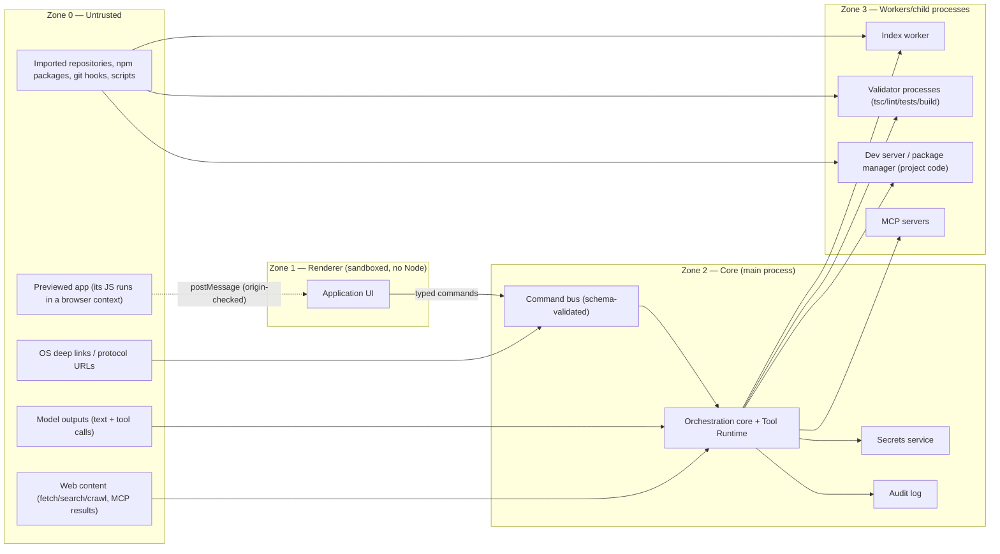

# AutoAPPZ Threat Model

STRIDE-style model for a local-first agentic development environment. It sets non-negotiable controls for every privileged capability: **explicit scope, schema validation, permission decision, audit record, cancellation, timeout**.

---

## 1. Assets

| Asset | Why it matters |
|---|---|
| A1 Provider API keys and OAuth tokens (LLM, GitHub, DB, deploy) | Direct financial and account impact |
| A2 User project source code and git history | The product's core promise ("you own the code") |
| A3 Project secrets (`.env*`, deploy keys, DB connection strings) | Lateral movement into production systems |
| A4 The user's machine (files outside projects, shell, network) | Agent tools and generated code execute locally |
| A5 Platform state (catalog DB, settings, task history, audit log) | Integrity of undo/checkpoints and billing |
| A6 Model context (prompts, tool results) | Prompt-injection channel |
| A7 Telemetry/diagnostic bundles | Privacy |

## 2. Trust zones and boundaries



Boundary rules:
- **B1 Renderer ↔ Core**: only typed commands with Zod schemas; renderer never receives secret values, absolute paths outside the project root, or process handles; every command carries `{sessionId, projectId, requestId}`; per-window capability tokens for long-lived subscriptions.
- **B2 Core ↔ Model**: tool calls validated against schemas; tool results size-bounded and delimited as data; system prompt never contains secrets; project instruction files are marked untrusted data and cannot change tool permissions.
- **B3 Core ↔ Project code execution**: everything that runs project code (install, dev server, tests, builds, hooks, repo-local binaries) is a **child process with explicit cwd, env allowlist, timeout, cancellation, and output bounds**; optional stronger isolation (container) is a runtime profile, not an afterthought.
- **B4 Core ↔ External services**: adapters own credentials; core passes capability handles, not tokens.
- **B5 Preview ↔ Renderer**: `postMessage` with explicit target origin and origin validation on receipt; injected instrumentation is minimal, versioned, and opt-out; preview never receives platform credentials.

## 3. STRIDE analysis

| Threat | Vector | Control (AutoAPPZ) | Verification |
|---|---|---|---|
| **Spoofing** | Malicious page spoofs the renderer to call IPC | Trusted-frame check (sender frame identity + URL allowlist), no `webview`, sandboxed popups | Integration test: untrusted frame invoke rejected |
| | Deep link impersonating an OAuth return | Pending-flow correlation (state nonce); unsolicited returns rejected; tokens never in URLs (use loopback code exchange with PKCE) | Test: unsolicited return → no settings write |
| **Tampering** | Model rewrites files outside project / overwrites user edits | Path scope (root-relative, realpath containment, symlink policy); changed-since-read hash check on every edit; git checkpoint before task | Property tests on path policy; edit conflict test |
| | Repo-provided `AI_RULES`-style instructions alter permissions | Instruction files are context data; permissions come only from the policy store | Test: instruction file cannot enable a denied tool |
| | Tool result injection (MCP/web) instructs the agent | Results wrapped as data with delimiters; high-risk tools require consent regardless of model intent | Eval: injection suite must not trigger writes |
| **Repudiation** | "What did the AI do?" cannot be answered | Audit log per tool call (who/what/scope/decision/result/ids), per-task checkpoint commit, exportable diagnostics | Test: every privileged tool emits an audit entry |
| **Information disclosure** | Secrets to renderer/model/logs/telemetry | Secrets service with opaque references; redaction middleware on logs, errors, telemetry, model context; `.env*` never read into context without explicit tool authorization | Test: secret fixture never appears in renderer payloads, logs, or prompts |
| | Debug bundles leak paths/tokens | Bundle builder applies redaction and lists what's included | Snapshot test |
| **Denial of service** | Runaway dev server/tests/builds; infinite repair loops | Runtime Supervisor limits (timeouts, restart backoff, output caps); bounded repair attempts; budget caps for model spend | Tests for each cap |
| | Port squatting / killing foreign processes | Never kill unknown PIDs; pick a free port from a reserved band; verify ownership before kill | Test with a foreign listener |
| **Elevation of privilege** | Generated/imported code executes at user privilege | Explicit execution profiles: `host` (default, warned), `container` (recommended for untrusted imports); never auto-run scripts on import; hooks/binaries from repo only via explicit tools with consent | Test: import does not execute anything |
| | "Allow always" grants unbounded power | Permissions scoped by tool **and** scope (paths, commands, hosts) and by lifetime (once/session/project) | Policy engine unit tests |
| | MCP server as arbitrary process | Servers added only through UI with explicit confirmation; deep-link additions are drafts requiring confirmation; env secrets encrypted | Test |

## 4. Privileged capability contract

Every tool in the Tool Runtime declares:

```ts
interface PermissionDescriptor {
  capability: "fs.read" | "fs.write" | "fs.delete" | "shell.exec" | "net.fetch" | "git.write" | "db.query" | "db.mutate" | "deploy" | "mcp.call" | "process.control";
  risk: "low" | "medium" | "high" | "destructive";
  scope: (input) => ScopeDescriptor;   // e.g. paths, command, host, table
  defaultPolicy: "ask" | "allow" | "deny";
}
```

Runtime guarantees: schema validation → scope resolution → policy decision (`ask | allow-once | allow-session | allow-project | deny`) → audit entry (pre + post) → execution with `AbortSignal` + timeout → bounded structured result → telemetry hook (metadata only).

## 5. Residual risks (accepted, documented)

- Running a project's dev server on the host is inherently code execution; the product warns on first run of an imported repo and offers the container profile.
- Local model providers (Ollama) receive project contents; privacy depends on the user's choice of provider.
- Denylist-based redaction can miss novel secret formats; secrets service references are the primary control.
