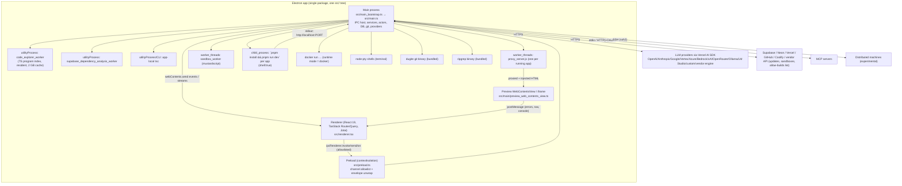
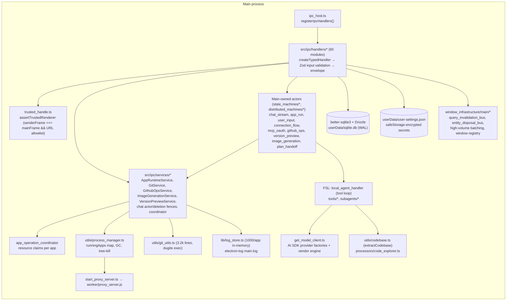
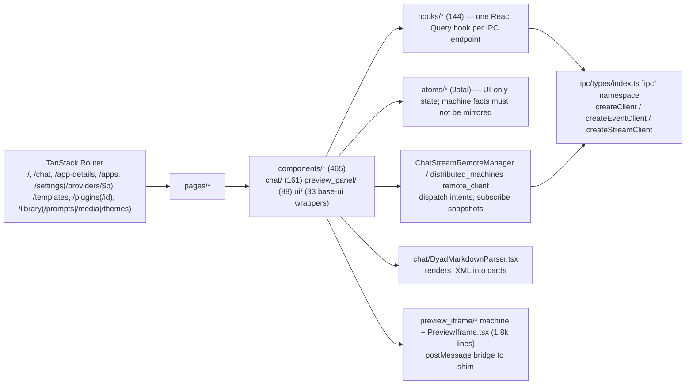
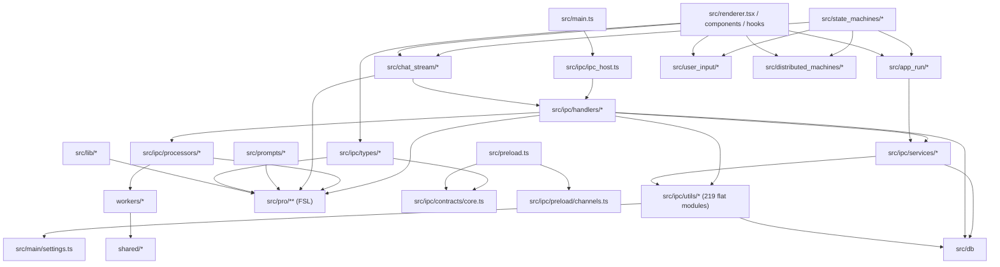

# Architecture Reconstruction — `dyad-sh/dyad` @ `39064d24`

Reconstructed from entry points, build configuration, handler registration and traced call paths. Descriptive only.

---

## 1. Process topology

**Key structural fact:** there is no package boundary between processes. `src/` contains main, preload, renderer and shared code; `tsconfig.app.json` compiles all of it as one project. Separation is enforced by import discipline (`rules/electron-ipc.md`) and by Vite entry points (`forge.config.ts`).

---

## 2. Main process internals

### 2.1 Startup order (`main.ts`)
1. Module load: crash reporter, session banner, log setup, protocol scheme privileges, `open-url`/`second-instance` listeners (deep links queued until a window is ready).
2. `app.whenReady()` → `onReady()` (see PRODUCT-REVERSE-ENGINEERING §2 Launch).
3. `registerIpcHandlers()` is called **before** `onReady` completes DB init (handlers must not touch DB at registration; rule documented).
4. `createWindow()` configures the renderer trust policy (`configureTrustedRenderer`) with the dev-server origin or packaged `file://…/index.html`.

### 2.2 IPC boundary
- **Contracts** (`src/ipc/types/*.ts`): `defineContract({channel,input,output,invalidates?})`, `defineEvent`, `defineSendContract`, `defineStream`. Zod v4 schemas are the single source of truth; the preload allowlist is derived from them (`src/ipc/preload/channels.ts`) — plus 5 hard-coded `test:*` channels always allowed.
- **Invoke envelope**: handlers return `{__dyadIpcEnvelope, ok, value|error}`; preload unwraps and rethrows `DyadError` with `kind`.
- **Handler registration facades**: `createTypedHandler` (validated), `createLoggedHandler` (legacy, unvalidated `any[]` args, logs args at debug level), `registerTrustedIpcHandler` (raw). All three enforce the trusted-renderer check. Output validation only in development.
- **Events main→renderer**: `safeSend`/`webContents.send`; high-volume `app:output-batch` batched every 100 ms; `chat:response:chunk` supports full-messages or tail-patch modes.
- **Streams**: `chat:stream` and `help:chat:start` invoke + `chunk/end/error` events correlated by `InvocationRef` (or legacy numeric `streamId`).
- **Query invalidation**: contracts declare `invalidates` scopes; `queryInvalidationBus` fans out to all windows with origin-handled deduplication.

### 2.3 Main-owned actors ("distributed machines")
Pure `transition(state, event) → {state, commands}` functions with a command runner, keyed hosts, invocation refs with cancellation tombstones, revisioned snapshots and a remote protocol (`distributed-machine:dispatch/subscribe/snapshot`) so multiple windows can drive one entity. Adopted for chat streaming, app run, user input, OAuth connection flows, MCP OAuth, GitHub ops, version preview, image generation, plan handoff, Coolify deploy. The rationale is documented in `docs/why-state-machines.md` (boolean-flag explosion produced dropped messages, double sends, cancel races).

### 2.4 Concurrency control
- `appOperationCoordinator.run({appId, operation, resources:[…], refuseWhenRecording?})` — atomic multi-resource acquisition per app, read/write modes, FIFO with optional compatible-queue bypass, deletion fences with `drain()`/`runExclusive()`.
- Stream admission barriers (`blockNewStreamsForApp/Chat`) with a documented "no `await` between check and clear" invariant.
- `withLock(stringKey)` for non-app identities (file paths, token refresh).
- `withChatQueueLock(chatId)` for turn acceptance.

---

## 3. Renderer internals

- React Compiler is enabled; Tailwind v4; Base UI primitives; Monaco for code; xterm for terminal; Lexical for the chat input (mentions, slash skills); Konva for the annotator (FSL UI).
- The renderer never spawns processes or touches the filesystem; it only calls contracts. It does, however, contain substantial orchestration logic (e.g. `useStreamChat`, `useTestRecorder` 1.5k lines, `ChatInput` 1.8k lines).

---

## 4. Application runtime and preview

See `RUNTIME-PREVIEW.md` for the full trace. Summary: `AppRuntimeService` (transport-neutral) ← `AppRunActorService` (main-owned machine) ← `run-app/stop-app/restart-app` handlers and agent lifecycle tools. Process registry is a module-level `Map<appId, RunningAppInfo>`. Three runtime modes: host (child process), docker (container), cloud (vendor sandbox with file sync).

---

## 5. Data and persistence

| Store | Location | Contents |
|-------|----------|----------|
| SQLite (Drizzle, 51 migrations) | `<userData>/sqlite.db` (+`-wal`, `-shm`) | apps, chats, messages, chat_turn_intents, chat_queue_*, agent_threads/messages/activities, versions, security_fix_chats, coolify_app_connections, language_model_providers/models, mcp_servers, mcp_tool_consents, prompts, app_collections, custom_themes, chat_search_* (FTS5 via custom migration) |
| Settings JSON | `<userData>/user-settings.json` (+`.bak`, `.recovery-*.bak`) | all user settings incl. encrypted provider keys and OAuth tokens |
| Backups | `<userData>/backups/` | up to 3 version-upgrade backups of settings + DB with checksums |
| Crash files | `<userData>/session.lock`, `renderer-crash.json`, crash dumps dir | crash detection |
| Templates cache | `<userData>/templates/<org>/<repo>` | shallow clones |
| TypeScript cache | `<sessionData>/typescript-cache` | tsbuildinfo per app |
| Media thumbnails | `<sessionData>/…` | derivatives |
| Per app | `<apps>/<slug>/` | user code (git repo), `.dyad/` (media, plans, screenshots, attachments manifest; gitignored), `.env.local` (provider-managed), `pnpm-workspace.yaml` (allow-builds policy), `e2e-tests/`, `playwright-dyad.config.ts` |
| Logs | `<userData>/logs/main.log` (electron-log) | main process logs; renderer logs via console |

Detailed schema and ER diagram: `DATABASE.md`.

---

## 6. External integrations map

| Integration | Module cluster | Transport/auth | Notes |
|-------------|----------------|----------------|-------|
| LLM providers | `get_model_client.ts`, `llm_engine_provider.ts`, `ollama_provider.ts`, `provider_options.ts`, `thinking_utils.ts` | AI SDK; API keys from settings/env; vendor engine via `auto` key; ChatGPT subscription (Codex OAuth) | Model catalog `language_model_constants.ts` (static) + DB custom + dynamic fetch |
| MCP | `mcp_manager.ts`, `mcp_handlers.ts`, `mcp_oauth/*`, `mcp_consent.ts`, `mcp_result_sanitizer.ts` | stdio (`StdioClientTransport`) or streamable HTTP (+OAuth PKCE via `@ai-sdk/mcp`) | Catalog of curated servers; per-tool consent; secrets encrypted |
| Supabase | `supabase_admin/*`, `supabase_handlers.ts` | OAuth via `dyad://supabase-oauth-return`, management API | Edge function deploy queue; SQL exec; test users |
| Neon | `neon_admin/*`, `neon_handlers.ts` | OAuth via `dyad://neon-oauth-return`, `@neondatabase/api-client`, serverless SQL | Branch-per-purpose; time-travel restore |
| Vercel | `vercel_handlers.ts`, `vercel_utils.ts`, `vercel_neon_sync*.ts` | token | Framework detection; env sync |
| GitHub | `github_handlers.ts`, `github_ops/*`, `git_utils.ts` | device flow OAuth; token via `GIT_CONFIG_*` env per call | fake server in tests |
| Coolify | `coolify_setup/*`, `coolify_deploy/*`, `coolify_client.ts`, `ssh_client.ts` | SSH + HTTP token | experimental |
| Capacitor | `capacitor_handlers.ts` | local CLI | iOS/Android |
| Vendor cloud | `dyad_engine_url.ts`, `cloud_sandbox_provider.ts`, `update-electron-app`, allow-builds list, help bot | HTTPS | proprietary services |
| Telemetry | `posthog-js` (renderer), `telemetry.ts` (main→renderer) | HTTPS | consent-gated |
| Auto-update | `update-electron-app` | GitHub releases via vendor update service | stable/beta channels |
| Keychain | Electron `safeStorage`; macOS `dyad-keychain-reader` native addon for legacy identity recovery | OS keychain | plaintext fallback on Linux without libsecret |

---

## 7. Dependency diagram (module level, Apache region)

Notable cycles/couplings: `chat_stream` ↔ `ipc/handlers/chat_stream_handlers.ts` (handler calls actor, actor calls handler via `executeChatStreamFromActor`); `src/lib/schemas.ts` (used by renderer) imports FSL; `src/ipc/types/index.ts` (renderer client) re-exports FSL types; `utils/` imports `main/settings.ts` which imports `lib/schemas.ts` which imports `pro/`.

---

## 8. Native modules and packaging

| Native | Purpose | Rebuild |
|--------|---------|---------|
| `better-sqlite3` | SQLite | yes |
| `node-pty` | terminal | yes (asar-unpacked) |
| `mustardscript` | sandboxed scripting for `execute_sandbox_script` | yes (asar-unpacked) |
| `dyad-keychain-reader` | macOS keychain read for legacy secret recovery | macOS only |
| `dugite` git | bundled git | extraResource |
| `@vscode/ripgrep` | file search | extraResource |
| `ssh2` | pure-JS fallback (native helpers excluded) | no |

Electron fuses lock down `RunAsNode`, `NODE_OPTIONS`, asar integrity; code signing per platform; provenance attestations at release.

---

## 9. Observations (facts that feed the design phase)

1. Two agent generations coexist; the newer one is outside the OSS region.
2. The main process is a **monolith of ~170k lines** with a flat `utils/` namespace and 30+ module-level singletons.
3. The team is mid-migration to explicit state machines; both styles coexist (e.g. `chat_stream_handlers.ts` still owns admission maps while `chat_stream/definition.ts` owns the actor).
4. Renderer contains large orchestration components/hooks; business rules such as mode/model compatibility are duplicated renderer/main by design ("mirror in renderer previews").
5. Vendor-cloud features are pervasive: gating logic appears in prompts, handlers, settings, telemetry and UI.
6. Security posture is thoughtful at the Electron boundary (trusted renderer, sandboxed popups, safe paths) but shell execution of package scripts and dev servers runs unsandboxed with `shell:true` (see `SECURITY-REVIEW.md`).
