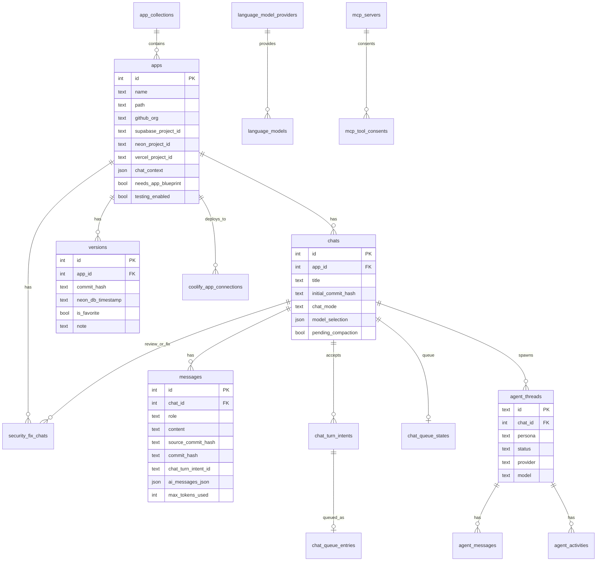

# Database Architecture — `dyad-sh/dyad` @ `39064d24`

---

## 1. Internal application database

- Engine: SQLite via `better-sqlite3` (`timeout: 10000`, `foreign_keys = ON`, `journal_mode = WAL` best-effort).
- ORM: Drizzle; schema `src/db/schema.ts`; 51 SQL migrations (`drizzle/0000…0050`) applied at startup with `migrate()`; failure → fatal dialog + quit.
- Location: `<userData>/sqlite.db` (dev: `./userData` or `DYAD_DEV_USER_DATA_DIR`).
- Corruption heuristic: file < 100 bytes is deleted before open.
- Backups: `BackupManager` copies settings + DB into `<userData>/backups/` on version upgrade (max 3, with checksums).
- Access pattern: a module-level `db` Proxy to a lazily initialized instance; handlers import `db` directly (some via `getHandlerContext()` for testability). Synchronous better-sqlite3 transactions (`db.transaction((tx)=>…)`) used for atomic turn acceptance and chat forking.
- Test seams: `setDatabaseForTesting`, isolated in-memory DBs per test.
- FTS: `chat_search_fts` virtual table created by a custom migration (Drizzle cannot model FTS5) with trigger-maintained dirty queues (`chat_search_dirty_messages/chats`) and `chat_search_meta` (projection version).

### 1.1 Tables

| Table | Purpose | Key columns |
|---|---|---|
| `apps` | project catalog | `name` (display, unique by convention), `path` (relative slug under apps dir **or absolute** for in-place imports), GitHub org/repo/branch, Supabase project/parent/org slug/test user, Neon project + development/preview/active/test branch ids + auth cookie secrets, `selectedDatabaseBranchType`, Vercel project/name/team/deployment URL, `installCommand`, `startCommand`, `chatContext` (JSON include/exclude globs), `isFavorite`, `themeId`, `needsAppBlueprint`, `testingEnabled`, `collectionId` |
| `chats` | conversations per app | `appId` (cascade), `title`, `initialCommitHash`, compaction fields (`compactedAt`, `compactionBackupPath`, `pendingCompaction`), `chatMode` (stored enum incl. deprecated `agent`), `modelSelection` (JSON), `referencedAppIds` (JSON), `isFavorite` |
| `messages` | transcript | `chatId` (cascade), `role` user/assistant, `content` (markdown + `<dyad-*>` XML), `approvalState`, `sourceCommitHash`, `commitHash`, `requestId`, `userInputRequestId`, `chatTurnIntentId` (unique per chat), `maxTokensUsed`, `model`, `inferenceSource`, `aiMessagesJson` (AI SDK v6 `ModelMessage[]` envelope), `usingFreeAgentModeQuota`, `isCompactionSummary` |
| `chat_turn_intents` | durable turn admission | `intentId` PK, `chatId`, `payloadHash`, `intent` JSON, `acceptance` queued/message-accepted/rejected, `recovery`, `terminalOutcome`, `acceptedMessageId` |
| `chat_queue_states` / `chat_queue_entries` | per-chat FIFO queue | `revision`, `paused`, `pauseReason` stop/manual/step-limit; entries `position`, `status` queued/claimed |
| `agent_threads` / `agent_messages` / `agent_activities` | sub-agents | persona explorer/reviewer/implementer, status enum (13 values), provider/model/effort, context/result JSON, review base/target/diff hash, invocation/remediation source, token and tool-call counters; messages (sequence, role root/assistant/system, consumed); activities (tool call id/name, status, `presentationXml`, input JSON, bounded output, error) |
| `versions` | metadata for git commits | `appId`+`commitHash` unique, `neonDbTimestamp`, `isFavorite`, `note` |
| `security_fix_chats` | maps review findings to fix chats | `appId`, `reviewChatId`, `findingKey`, `fixChatId` |
| `coolify_app_connections` | deployment target per app | server/project UUIDs, environment, application UUID, domain, app URL, last deployed |
| `language_model_providers` / `language_models` | custom providers/models | `api_base_url`, `env_var_name`; models: `apiName`, `builtinProviderId` or `customProviderId`, `max_output_tokens`, `context_window` |
| `mcp_servers` / `mcp_tool_consents` | MCP config | transport, command/args, encrypted env/headers (legacy plaintext columns retained), URL, OAuth fields (encrypted state/secret), `catalogSlug` unique; consents per server+tool |
| `prompts` | prompt library | title/description/content/`slug` unique |
| `app_collections` | folders for apps | name unique |
| `custom_themes` | design themes | name/description/prompt |
| `chat_search_dirty_*`, `chat_search_meta` | FTS maintenance | — |

### 1.2 ER diagram

### 1.3 What is *not* in SQLite
- User settings + provider keys + OAuth tokens → `user-settings.json` (encrypted fields; see `SECURITY-REVIEW.md`).
- Plans → `<app>/.dyad/plans/*.md`. Attachments/media → `<app>/.dyad/media/` + `attachments-manifest.json`. Screenshots → `<app>/.dyad/screenshots/`.
- Blueprints → in-memory only.
- Logs → in-memory + `main.log`.
- Git state → the app repository itself; `versions` only decorates commits.

---

## 2. Databases for generated user applications

| Provider | Linking | Runtime config written to app | Operations | Versioning/tests |
|---|---|---|---|---|
| **Supabase** (hosted) | OAuth per organization (`supabase.organizations[slug]` tokens); project pick/create (regions list); `apps.supabaseProjectId/ParentProjectId/OrganizationSlug` | client code generated into app (`getSupabaseClientCode`), publishable vs legacy anon key detection/switch | SQL via management API `runQuery` (raw SQL only); edge functions deployed per write, redeploy-all, shared-module dependency analysis; edge logs; optional migration files under `supabase/migrations/` for schema-mutating SQL | e2e isolation via throwaway auth user (`supabaseTestUserId`, RLS-scoped); orphan cleanup on startup |
| **Supabase local** | CLI detection (`supabase status`), `supabaseMode` (`UNVERIFIED` details) | — | executes against local Postgres | — |
| **Neon** | OAuth; project create/list; branches: `development`, `preview`, `production`; `neonActiveBranchId`, `selectedDatabaseBranchType`; email/password auth config | `.env.local` `POSTGRES_URL` swapped per branch; `DB_PUSH` disabled during previews; auth cookie secrets | SQL via serverless driver on active branch; project info; branch env vars; Vercel sync | **time-travel**: `neonDbTimestamp` stored on `versions` at each commit; revert restores the dev branch from timestamp (preserve branch cleanup), preview checkouts restore the preview branch; retention-window errors handled; throwaway test branches (copy-on-write) for e2e |
| **Custom Postgres** | `DATABASE_URL` in app env (`database_url_guide` e2e) | — | not managed | no isolation ("Tests panel warns") |
| **Portal migration** | `migration:migrate/preview` (Payload/Portal template) | — | — | — |

Schema diffing/classification: local packages `ts-pg-schema-diff` (schema model + DDL rendering + diff; Postgres-backed integration tests) and `pg-schema-classifier` (classifies SQL statements as schema-mutating / destructive; used for auto-approval decisions `doesSqlMutateSchema`, `doesSqlDeleteData`).

Destructive-operation protection: destructive SQL never auto-applied in gen-1; gen-2 `execute_sql` consent classifier is conservative (unparseable, `DO/CALL`, `EXPLAIN ANALYZE`, `PREPARE/EXECUTE` require consent); dropping tables requires explicit confirmation (product principles).

---

## 3. Observations for design

1. Chat transcripts store both a **display projection** (`content` XML) and a **model projection** (`aiMessagesJson`) — dual sources of truth with cleanup jobs.
2. Git commit metadata (`versions`) is decoupled from the repo: deleting/rewriting history orphans rows silently.
3. Provider linkage lives as many nullable columns on `apps` (Supabase ×5, Neon ×8, Vercel ×4, GitHub ×3) — an integration-per-column design with comments explaining consumer-specific null semantics.
4. Settings JSON holds secrets and is rewritten (re-encrypted) on every settings change; recovery/backup logic is elaborate because of past keychain incidents.
5. No schema for "project memory" (decisions, conventions) beyond `AI_RULES.md` and chat FTS.
