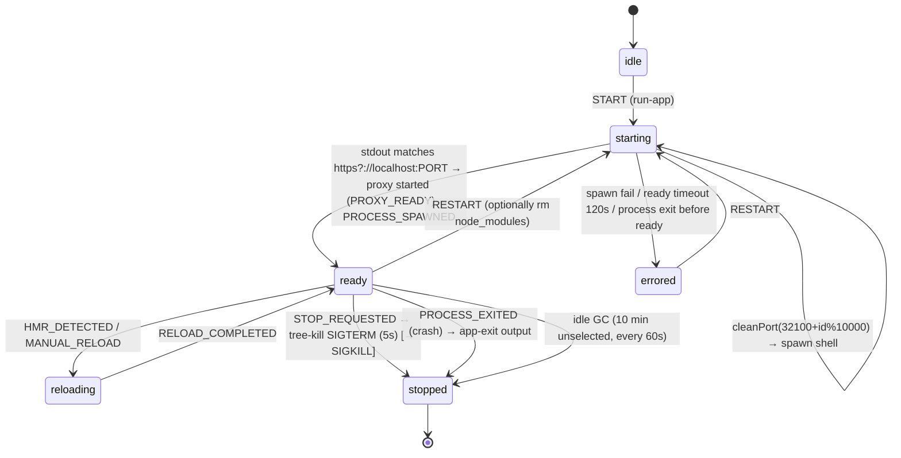

# Runtime and Preview Engine — `dyad-sh/dyad` @ `39064d24`

Trace: `generated source → install → dev server → port selection → proxy/iframe → preview → logs → error detection`.

---

## 1. Components and ownership

| Concern | Owner | Notes |
|---|---|---|
| Run/stop/restart intent | `app_run` main-owned actor (`src/app_run/*`, `app_run_actor_service.ts`) | events START/RESTART/STOP_REQUESTED/MANUAL_RELOAD; producer events PROCESS_SPAWNED/FAILED/STOPPED/EXITED, PROXY_READY, HMR_DETECTED, RELOAD_COMPLETED; revisioned snapshots for renderers |
| Execution | `AppRuntimeService` (`app_runtime_service.ts`) | transport-neutral; `runSerialized` via `appOperationCoordinator` (`app-runtime:start\|restart\|stop`) |
| Process registry | `process_manager.ts` `runningApps: Map<appId, RunningAppInfo>` + `processCounter` | module-level singleton |
| Proxy | `start_proxy_server.ts` → `worker/proxy_server.js` (worker thread per app) | HTML injection, WS forwarding, fallback ports |
| Output | `AppRuntimeOutput` (`app_runtime_transport.ts`) → batched `app:output-batch`; `log_store.ts` (1000 entries/app) | typed entries: stdout/stderr/input-requested/app-exit/package-manager-warning/sync-error/agent-lifecycle-* |
| Preview surface | `PreviewIframe.tsx` (iframe) or `preview_web_contents_view.ts` (native `WebContentsView` for test automation with CDP broker) | `preview_iframe` state machine in renderer |
| Terminal | `pty_session_manager.ts` (node-pty) | separate from dev-server process |
| Type-check/explorer processes | `typescript_utility_process_scheduler.ts` | serialized |

---

## 2. Lifecycle trace (host mode)

Steps in detail:
1. **Command**: custom `install && start` if configured; else pnpm: `pnpm --config.pm-on-fail=ignore --config.confirmModulesPurge=false --config.strictDepBuilds=false install && <best-effort pnpm rebuild promoted pkgs> && pnpm --config.pm-on-fail=ignore run dev --port <port>`; npm fallback `(npm install --legacy-peer-deps && npm run dev -- --port <port>)`. Before pnpm, `ensurePnpmAllowBuildsConfigured` writes/updates `pnpm-workspace.yaml` (allow-builds list, minimum release age).
2. **Spawn**: `spawn(command, [], {cwd: appPath, env, shell: true, stdio: "pipe", detached: false})`; env from `getPackageManagerCommandEnv()` (Corepack pins disabled, managed pnpm/node on PATH; `fix-path` for macOS GUI PATH). No sandbox, no resource limits, user privileges.
3. **Readiness**: stdout regex for localhost URL → `ensureProxyForRunningApp` → `waitForAppReady` polls `proxyUrl` every 100 ms up to 2 min. `y/N` prompts detected (`› (y/N)`) and surfaced as `input-requested`; Neon drizzle prompt auto-answered with Enter.
4. **Ports**: app `32100 + appId % 10000`; proxy `42100 + appId % 10000` (deterministic for stable origin), fallback scan `52100..52149`; e2e blocks. `cleanUpPort` uses `kill-port` (kills whatever listens there — including foreign processes) or `docker stop` by published port.
5. **Proxy injection**: HTML responses get `<script>` tags for `stacktrace.js`, `dyad-shim.js` (navigation/history bridge, error/rejection/overlay reporting), `dyad_logs.js` (console forwarding), component selector, visual editor, screenshot (`html-to-image`), recorder, auth bootstrap (token-gated credential injection), service-worker registration (network capture). Fixed headers for cloud auth.
6. **Termination**: `killProcess` → `tree-kill SIGTERM` with 5 s timeout (resolves even if alive); `forceKillProcessTree` → SIGKILL with close confirmation (used before deleting directories); `stopAllAppsSync` on quit uses synchronous tree kill. Proxy worker terminated; cloud sandbox destroyed; docker container stopped.
7. **Crash detection**: `close` event with non-zero code → `app-exit` output + map cleanup; `error` event; pnpm `ERR_PNPM_IGNORED_BUILDS` triggers one self-heal reinstall.
8. **Restart**: stop → cleanPort → optional `rm -rf node_modules` (+ docker volumes) → start; external (agent) lifecycle claims with invocation refs and cancellation tombstones; "rebuild" = restart + remove node_modules + recreate sandbox.
9. **GC**: every 60 s, apps not selected and unviewed ≥10 min are stopped (unless `previewIdleTimeoutPolicy: never`).

Docker mode: `docker build -f Dockerfile.dyad` (generated `node:22-alpine` + pnpm) then `docker run --rm -p port:port -v app:/app -v pnpm-store …` executing the same command string via `sh -c`. Cloud mode: vendor sandbox API, file map upload, log stream, in-place restart, share links.

---

## 3. Health checks, zombies, resource consumption

- Health = "proxy URL known"; no periodic liveness probe; a hung dev server that keeps its port is considered ready.
- Zombie risk: `shell:true` spawns `sh`/`cmd` whose grandchildren (`vite`) can outlive the parent; `tree-kill` mitigates; the code comments acknowledge reparented descendants are unreachable and that Windows keeps directories locked (rename/delete retry logic).
- Foreign-process kill: `kill-port` on the app port will terminate unrelated processes that happen to listen on that port (comment acknowledges collision at 10k apps).
- Memory: performance monitor snapshots heap/RSS per process type; OOM classifier; code-explorer cache budget; logs bounded (1000/app); output batching.
- No CPU/memory limits on child processes; Docker mode gives isolation but no limits.

---

## 4. Logs and error detection

| Source | Path to UI | Feeds AI? |
|---|---|---|
| Dev server stdout/stderr | `output.enqueue` → `app:output-batch` → Console panel (filters: client/server/edge/network/build) and `log_store` | via `read_logs` tool (agent) and "Fix error" prompts |
| Browser runtime errors | shim `window.error`/`unhandledrejection` → sourcemapped via stacktrace.js → `postMessage` → `preview_iframe` machine → error banner | "Fix error with AI" includes message/stack |
| Build errors | Vite overlay DOM detection → `build-error-report` | banner |
| Console logs | `dyad_logs.js` forwards console.* → Console panel | `read_logs` |
| Network | service worker records fetches → Console "network" filter (`UNVERIFIED` end-to-end) | — |
| Navigation | shim `dyad-document-loaded`, push/replace/traverse → address bar/back/forward | — |
| HMR | log parsing (`HMR_DETECTED`) → reload state | — |
| Type errors | Problems panel (tsc) | `run_type_checks` |
| Test failures | Tests panel (Playwright JSON/report) | `run_tests` returns artifacts |

Blank-screen detection: none. Failed-network-request surfacing: partial (`UNVERIFIED`). Warnings vs errors: banner only for errors; console warnings are informational.

---

## 5. Platform behavior

| Platform | Notes from code |
|---|---|
| Windows | `.cmd` shim resolution and `cmd.exe` quoting rules (`windows_command.ts`, `rules/windows-spawn.md`); PATH refresh from registry after installers; WSL PATH entries filtered for git; aggressive file locks → rename/delete retries and warnings; junction handling in build snapshots; case-insensitive path conflicts |
| macOS | `fix-path` for GUI PATH; keychain identity issues for `safeStorage` (legacy recovery via native addon); code signing/notarization; move-to-Applications prompt; `/var` vs `/private/var` realpath canonicalization |
| Linux | experimental; `dyad://` registration helper; libcurl shim for bundled git; no libsecret → plaintext secrets; clang-18 native rebuilds; no e2e |

---

## 6. Facts that shape the AutoAPPZ Runtime Supervisor design

1. Readiness is inferred from a stdout regex; there is no HTTP health probe or explicit "server ready" contract.
2. Process state lives in a mutable map with many bespoke fields (`recordingOwnedRestart`, cloud tokens, proxy handles); the actor machine is layered on top rather than being the single owner.
3. Install and dev server are one shell string — failures cannot be attributed to a phase without log parsing, and cancellation cannot stop "install" separately from "dev".
4. Deterministic ports are a good idea for origin stability; killing whatever holds the port is not.
5. Injected preview scripts are broad (nine scripts incl. visual editor/recorder) and coupled to vendor features; the shim's postMessage protocol is undocumented.
6. Three runtime modes multiply code paths (host/docker/cloud) inside one service.
